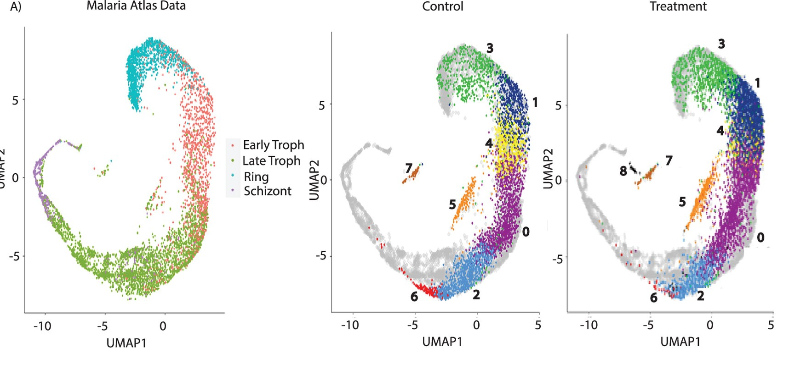

# Synchronised Plasmodium Cell Atlas

This repository contains analysis code for studying the effect of temperature stress on the life cycle of *Plasmodium falciparum*. We also used the Malaria Cell Atlas to map the development stages , and found one distinct state that was present only in the temperature-stress induced cells. 



Website for Data Exploration: https://sjohri.shinyapps.io/synchronised_plasmodium_cell_atlas/

Citation for the Publication: 
```
Rawat, M., Srivastava, A., Johri, S., Gupta, I., & Karmodiya, K. (2021). Single-Cell RNA Sequencing Reveals Cellular Heterogeneity and Stage Transition under Temperature Stress in Synchronized Plasmodium falciparum Cells. Microbiology Spectrum, 9(1), e00008-21.
```


